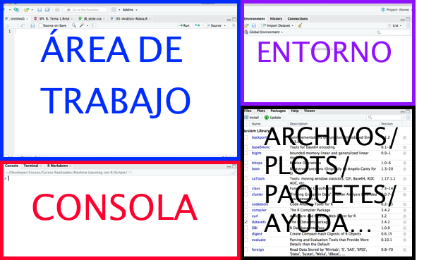

```{r setup, include=FALSE}
knitr::opts_chunk$set(echo = TRUE, comment = NA)
```


::: aligncenter

:::

# Más información

[Diplomado en Data Science](https://econtinua.udla.cl/diplomado-en-data-science/)

[Magíster en Data Science](https://econtinua.udla.cl/magister-en-data-science/)


## Objetivos

1.- instalación de R y Rstudio: Rstudio es un entorno de desarrollo
integrado (IDE) que hace más fácil la manipulación de código de R.

2.- R sobre Collaboratory

3.- Primeros pasos en R.

## Instando R

::: aligncenter

:::

Para instalar R, primero vamos a guiarnos por material externo desde
[aqui](https://rubenfcasal.github.io/post/instalacion-de-r/)

1.- El primer paso es ir a descargar R, para ello hay varios mirrors,
vamos a utilizar el link donde se encuentra [R desde
uChile](https://cran.dcc.uchile.cl/)

::: aligncenter


Seleccionamos R para Windows y luego pinchar en base. Se darán cuenta
que van en la versión 4.3.2.
:::

Seleccionamos R para Windows y luego pinchar en "base".


Luego vamos a ver el asistente de investigación de Windows y cómo
recomendación se debe seleccionar "ventanas simples" (SDI) en lugar de
múltiples ventanas MDI


Una vez terminada la instalación, al abrir R aparece la ventana de la
consola (es parecido a un terminal de Unix) que permite ejecutar
comandos de R.

Después de la instalación de R suele ser necesario instalar paquetes
adicionales (puede ser recomendable Ejecutar como administrador R para
evitar problemas de permiso de escritura en la carpeta C:\Program
Files\R\R-X.Y.Z\library

## Instando RStudio

::: aligncenter

:::

Para ello nos guiaremos por este
[tutorial](https://rubenfcasal.github.io/post/instalacion-de-rstudio/)

1.- [Descargar Rstudio](https://posit.co/download/rstudio-desktop/)

Al ejecutarlo deberían ver una consola de este tipo

::: aligncenter

:::

\*RStudio es un interfaz gráfica para usar R y esta disponible para
todos los sistemas operativos. En otras palabras, es un entorno
integrado para utilizar y programar con R

Existen 4 ventanas, en donde podemos ver el área de trabajo, el entorno,
la consola y los archivos o gráficos que se van generando 

  


**Para Ubuntu o Linux**

1.  Abrir una terminal y se instala via comando con:

`sudo aptitude install r-base`

\*\* RStudio en Ubuntu o Linux\*\*

1.  [Obtener RStudio](http://www.rstudio.com/products/rstudio/download/)

2.  Luego de descargar el .deb, abrir una terminal y colocar el
    siguiente comando: `sudo dpkg -i rstudio-<version>-i386.deb`

    `version` refiere ala versión concreta que se haya descargado

#Consideraciónes

Se presentan algunas consideraciónes del lenguaje R

## Comandos de Ayuda

-   `help()`: obtener ayuda por consola [mas información](https://www.r-project.org/help.html)
-   `??...`: obtener ayuda por consola
-   Pestaña `Help` de Rstudio
-   [Cheat Sheet de
    RStudio](https://www.dropbox.com/s/l3uutpfz5vlujow/rstudio-ide-1.pdf?dl=0)
-   Si tiene problemas de código recomiendo buscar en Google o en páginas como stackoverflow, R project, Kaggle, Rpubs, etc)

::: aligncenter

:::

## Instalación de Paquetes


-   `install.packages("nombre_paquete", dep = TRUE)`: instala o actualiza un paquete de R, con dependencias                                                 

-   `library(nombre_del_paquete)`: Si ya esta instalado, este comando permite cargae un paquete 

# Comenzando con R

En la consola o en el area de trabajo de RStudio podemos realizar operaciones básicas.

##  Operaciones aritméticas con R


| Código | Operación                |
|--------|--------------------------|
| `+`    | Suma                     |
| `-`    | Resta                    |
| `*`    | Multiplicación           |
| `/`    | División                 |
| `^`    | Potencia                 |
| `%/%`  | Cociente entero          |
| `%%`   | Resto de división entera |


```{r}
5+2

90 - 105

77*5

10/2


10%%2
```
```{r}
#Sumatoria de los números 1 al 5
sum(1:5) 
```

```{r}
#Multiplicatoria de los números 1 al 5
prod(1:5) 
```


# Atajos del Teclado en RStudio

| Código | Operación                |
|--------|--------------------------|
| `ctr+ENTER`    |  Run (correr una linea)                    |
| `ctr + z`    | Deshacer           |
| `ctr + v`    | Pegar                 |
| `ctr + c`    | Copiar               |
| `ctr + x`  | Cortar          |


## Asignación de nombres a objetos
Si bien se puede hacer con los operadores `=` o `<-`. Aqui vamos a utilizar el `<-` (el
`=` los reservaremos para los parámetros de las funciones)

```{r}
a <- 3
print(a)
b = 10
print(b)
c <- a*b
print(c)

```


## Código y significado

| Código | Significado                                        |
|--------|----------------------------------------------------|
| `pi`   | [$\pi$](https://es.wikipedia.org/wiki/Número_π)    |
| `Inf`  | [$\infty$](https://es.wikipedia.org/wiki/Infinito) |
| `NaN`  | Indeterminación (Not a Number)                     |
| `NA`   | Valor desconocido (Not Available)                  |

```{r}
pi
```


##  Funciones

```{r}
sqrt(9)

```


### Comparaciones
```{r}
"A" == "a"

"b " != "b"

"b" != "b"
```


## Trigonometría en radianes

```{r}
sin(pi/2)
cos(pi)
tan(0)
```


## Números en coma flotante

| Código       | Función                                                                 |
|--------------------|----------------------------------------------------|
| `print(x,n)` | Muestra las $n$ cifras significativa del número $x$                     |
| `round(x,n)` | Redondea a $n$ cifras significativas un resultado o vector numérico $x$ |
| `floor(x)`   | $\lfloor x\rfloor$, parte entera por defecto de $x$                     |


```{r}
print(pi,3)
round(pi,2)
floor(pi)
```

## Creación de vectores 

```{r}
v1 <- c(1,24,12)
```

Utilizando [ ] se puede extraer un elemento o subconjunto de elementos de un vector

```{r}
v1[1]
```

**Nota importante: En R la numeración comienza en 1, mientras que en Python empieza en 0**

## Operaciones sobre vectores 

```{r}
v1*3
v1
v2 <- v1 * 3
v2
```

```{r}
#Operaciones enre vectores de igual tamaño
v2 <- c(1, 6, 50) - c(1,-12,3.6)
v2

```

# Practiquemos en RSutdio .....


# Se puede hacer esto mismo en Google Colab
[Link: https://colab.to/r](https://colab.to/r)

También puede ser este link `https://colab.research.google.com/notebook#create=true&language=r`

